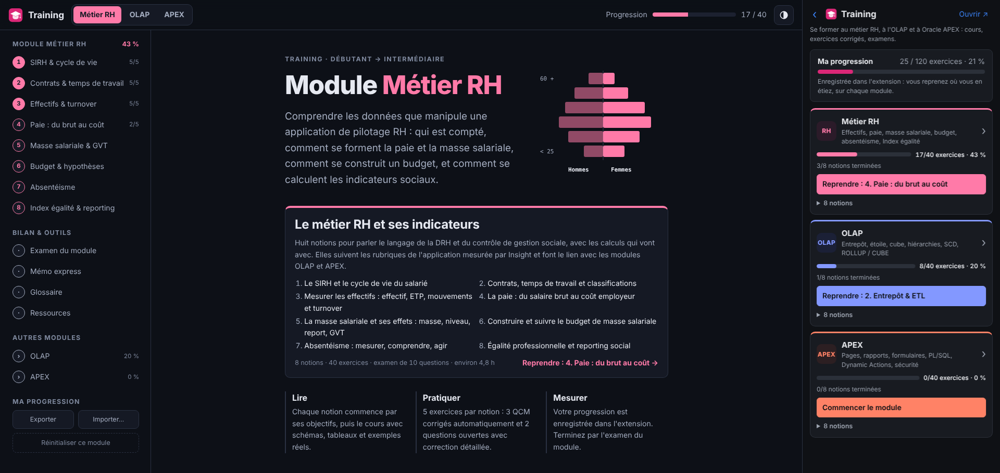

<h1 align="center">
  
</h1>


---

# Allshare Tools Kit — Boîte à outils Chrome

## Aperçu
Extension Chrome qui réunit, dans un **panneau latéral**, quatre outils pour les consultants qui déploient et font vivre une application de pilotage RH auprès d'un parc de 100 à 200 clients :

1. **Capsule** : la sauvegarde des onglets d'une fenêtre, pour les rouvrir d'un clic ;
2. **Insight** : la mesure du temps entre **le clic** et **l'affichage complet** d'une page, par client, SID, version, page et réseau (**Ethernet** ou **WiFi**), avec exports Excel et CSV ;
3. **Prisme** : l'inspection d'un fichier CSV (encodage, séparateurs, colonnes décalées, accents cassés…) et sa conversion en ANSI ou en UTF-8 ;
4. **Training** : des formations complètes, avec exercices corrigés et progression enregistrée, en trois modules : **Métier RH**, **OLAP** et **Oracle APEX**.

À chaque ouverture, le panneau demande **Quels outils ?**. Tout reste **dans le navigateur** : aucune donnée n'est envoyée sur Internet. En bas de l'accueil, **Exporter mes données Tools Kit** les enregistre toutes dans un fichier, à réimporter après une réinstallation ou sur un autre poste.

## Fonctionnalités

### Training : se former (`training/`)
- **3 modules × 8 notions**, chacune avec ses **objectifs**, un **cours détaillé** (schémas, tableaux, exemples SQL, PL/SQL et JavaScript réels) et un encadré **À retenir**
- **120 exercices** : pour chaque notion, **3 QCM** corrigés automatiquement (avec explication) et **2 questions ouvertes** (réponse à rédiger, correction détaillée, points clés attendus, auto-évaluation) ; les options des QCM sont mélangées, toujours dans le même ordre pour un exercice donné
- Par module : un **examen** de 10 questions, un **mémo express**, un **glossaire filtrable** et des **ressources** officielles
- **Métier RH** : SIRH et cycle de vie du salarié, contrats et ETP, effectifs et turnover, paie, masse salariale (effets masse, niveau, report, GVT), budget et hypothèses, absentéisme, Index égalité et reporting social, en lien avec les rubriques de l'application mesurée
- **OLAP** et **APEX** : la formation [OLAP & APEX Training](https://github.com/Pierre-Portfolio/Olap-Apex-Training) découpée en deux modules indépendants, avec son **laboratoire interactif du cube** et le script SQL du **projet fil rouge** à télécharger
- **Progression enregistrée dans l'extension** (réponses, scores, textes saisis, dernière notion lue) : le panneau affiche l'avancement de chaque module et un bouton **Reprendre** ; export / import JSON pour passer d'un poste à l'autre, réinitialisation par module
- Thème **clair / sombre / système**, mise en page **responsive**

### Capsule : sauvegarde des onglets (`panel/capsule.html`)
- **Sauvegarder cette session** : enregistre les onglets de la **fenêtre où vous êtes**, avec un **titre**, un **client associé** (auto-complété avec les clients d'Insight) et un **commentaire**
- **Mes sessions** : titre, client, nombre d'onglets et date ; **Rouvrir** recrée une fenêtre avec tous les onglets (épinglés compris), un clic sur un lien n'ouvre que celui-là
- **✎ Renommer** (session dépliée) : le titre devient un champ, **Entrée** ou un clic ailleurs enregistre, **Échap** annule
- **Pages d'une session** modifiables une fois la session dépliée : **×** retire une page ; **Ajouter** une adresse saisie (`exemple.fr/page` devient `https://exemple.fr/page`) ou **＋ Ajouter l'onglet affiché** dans la fenêtre ; une page déjà présente n'est pas ajoutée deux fois
- **Case à cocher** à gauche de chaque session : cochée, la session n'est **plus active** et apparaît **barrée** ; filtre **Toutes / Actives / Inactives** au-dessus de la liste
- **Glisser-déposer** : l'ordre des sessions se change en les faisant glisser les unes au-dessus ou en dessous des autres ; il est gardé, y compris par l'export / import de « Mes données »
- Seules les pages web sont enregistrées (http, https, fichiers locaux), pas les pages internes de Chrome ni la navigation privée

### Insight : temps de réponse des pages (`panel/panel.html`, `report/`)
- **Formulaire** : réseau (**Ethernet** par défaut, ou WiFi), **Client**, **SID**, **Version application**, **Page** (liste du menu de l'application, avec **Dashboard** tout en haut puis les pages par rubrique, ou **✎ Saisie libre**) et **Page spécifique ?**
- **Mesure** : le chrono part **au clic** sur le lien de la page à mesurer et s'arrête quand la page est **complètement affichée** ; pages classiques comme applications sans rechargement (Angular, React…)
- **Résultat** : **↻ Relancer en WiFi** (même page, l'autre réseau : l'onglet revient seul à la page de départ), **↻ Refaire en Ethernet** (une mesure de plus), **Page suivante →** (la prochaine page non mesurée est choisie **et l'enregistrement relancé aussitôt** : il ne reste qu'à cliquer sur cette page dans l'application ; **Annuler** ramène au formulaire)
- **Détail du chargement** : redirection, DNS, connexion, **attente serveur (requêtes SQL comprises)**, téléchargement, DOM, load, appels AJAX, requêtes les plus lentes
- **Pour aller plus vite** : auto-complétion, client proposé d'après l'onglet, SID et version repris de la dernière mesure, avancement Ethernet / WiFi de la ligne client, raccourci <kbd>Alt</kbd>+<kbd>Maj</kbd>+<kbd>M</kbd>
- **Tableau de bord et exports** : grille clients × pages (vues Ethernet + WiFi, Ethernet, WiFi, Écart), tri, recherche, filtres « Incomplets » et « Anomalies », détail d'un client, suppressions ; exports **Excel** ou **CSV** en une ligne (tout, une page, un client, détail des temps), avec URL complète et fin d'URL en option
- **Modifier une ligne** (menu ⋯ ou détail du client) : client, SID et version ; toutes les mesures de la ligne suivent (regroupées si la ligne existe déjà, client renommé dans le référentiel s'il n'a pas d'autre ligne)
- **Relancer une mesure** : **double-clic sur une case** du tableau de bord (ou du détail d'un client) → la page de départ s'ouvre dans un nouvel onglet avec l'enregistrement lancé, il ne reste qu'à cliquer sur la page ; l'ancienne mesure est remplacée quand la nouvelle est enregistrée (case à décocher pour la garder). Sur une case **N/A**, la page est mesurée pour la première fois
- **Secondes ou millisecondes** : durées en **secondes** par défaut (« 1,23 s »), en millisecondes au choix (bouton **s / ms** du tableau de bord ou Réglages) ; s'applique au panneau, à l'indicateur sur la page et aux exports Excel / CSV
- **Réglages** : référentiel des clients (import en masse depuis Excel) et des pages (ordre des colonnes), délai de calme, durée maximale, zones à ignorer, unité des durées, seuils des anomalies, sauvegarde / fusion JSON des mesures

### Prisme : inspection et conversion de CSV (`panel/prisme.html`, `prisme/`)
- **Dépôt d'un fichier** (ou exemple avec erreurs), **encodage attendu** ANSI ou UTF-8, refus clair des classeurs, archives, PDF et images
- **Verdict** : erreurs et alertes, encodage, séparateur, fins de ligne, lignes, colonnes, 5 principales anomalies
- **53 contrôles** classés en erreur, alerte ou info : encodage, structure, guillemets, contenu (accents cassés, espaces insécables, formules…), cohérence des colonnes, fins de ligne
- **Tableau de bord** : résumé, 4 vues (Détails, Données brutes, Visuel d'Excel, CSV brut) et **inspecteur de cellule** (caractères un par un, octets ANSI et UTF-8)
- **Exporter en ANSI** ou **en UTF-8** (avec BOM), option CRLF ; les 10 derniers fichiers restent disponibles

### Mes données : sauvegarde complète (accueil, `lib/backup.js`)
- **Exporter mes données Tools Kit** : un seul fichier JSON avec **toutes les données de l'extension** : mesures, clients, pages et réglages d'Insight, sessions de Capsule, fichiers récents de Prisme (contenu compris) et ses réglages, progression de Training et son thème
- **Importer mes données Tools Kit** : ajoute le contenu du fichier aux données du poste, **sans rien effacer** ; une donnée déjà présente est ignorée (réimporter le même fichier ne crée pas de doublon), les réglages du fichier sont repris
- À faire **avant de supprimer ou de réinstaller l'extension**, ou pour **retrouver ses données sur un autre poste**

## Technologies
- **JavaScript / HTML / CSS** — extension Chrome **Manifest V3**, modules ES, sans framework ni dépendance d'exécution
- **API Chrome** — panneau latéral (`sidePanel`), `storage`, `scripting`, `tabs`, `windows`
- **API Web natives** — Navigation Timing, `PerformanceObserver`, `MutationObserver`, `TextDecoder`, IndexedDB, `Blob`
- **Excel** — générateur `.xlsx` maison (cases colorées, volets figés, filtres)
- **Node.js** (tests unitaires, `node --test`) et **Playwright** (test de bout en bout dans Chromium)

## Installation

Clonez le dépôt :

```bash
git clone https://github.com/Pierre-Portfolio/Allshare-Tools-Kit.git
cd Allshare-Tools-Kit
```

Aucune dépendance n'est requise pour utiliser l'extension.

### Charger l'extension

1. Dans Chrome, ouvrez `chrome://extensions` et activez le **Mode développeur**.
2. Cliquez sur **Charger l'extension non empaquetée** et sélectionnez le dossier **`extension/`**.
3. Épinglez l'icône Allshare Tools Kit (pièce de puzzle → épingle). Le badge indique le réseau d'Insight (`ETH` / `WiFi`), ou `PRÊT` quand une mesure attend votre clic.

Chrome 116+ (ou Edge, Brave… récents). Pour mettre à jour : `chrome://extensions` → ↻ sur Allshare Tools Kit. Les mesures, sessions, fichiers récents et la progression des formations sont conservés.

Avant de **supprimer** l'extension (nouvelle version installée à la place, changement de poste) : **Exporter mes données Tools Kit** en bas de l'accueil, puis **Importer mes données Tools Kit** dans la nouvelle installation. Supprimer l'extension efface ses données.

### Tests

```bash
npm test               # tests unitaires (Node 18+, aucune dépendance)
npm install            # installe Playwright pour le test de bout en bout
npm run test:e2e       # charge l'extension dans Chromium et déroule le parcours complet
npm run zip            # crée allshare-tools-kit.zip (dossier extension/)
```

Le test de bout en bout sert deux applications de démonstration aux délais connus et déroule tout : mesures Insight (Ethernet par défaut, relance, page suivante relancée automatiquement, SPA, annulation, suggestion), exports, unité s / ms, modification d'une ligne, relance par double-clic depuis le tableau de bord, réglages, Capsule, Prisme et Training (réponses, rechargement, reprise, onglet réutilisé, laboratoire du cube, export / import de la progression) et la sauvegarde complète (export depuis l'accueil, extension vidée, réimport sans doublon). Captures et fichiers dans `tests/e2e/out/`.

## Structure du projet
```
Allshare-Tools-Kit/
  README.md                  → Présentation du projet
  package.json               → Scripts de test et d'empaquetage
  extension/
    manifest.json            → Manifest V3 (nom, permissions, panneau latéral, raccourci)
    background.js            → Service worker : déroulé d'une mesure Insight, badge, raccourci clavier
    content/                 → Scripts de mesure injectés dans l'onglet mesuré, pendant une mesure seulement
    panel/                   → Panneau latéral : accueil « Quels outils ? », Capsule, Insight, Prisme, Training
    training/
      training.html|js|css   → Page de formation : sommaire, notions, exercices, examen, mémo, glossaire
      content/rh/            → Module Métier RH (8 notions + examen, mémo, glossaire, ressources)
      content/olap/          → Module OLAP (8 notions, dont le laboratoire du cube)
      content/apex/          → Module APEX (8 notions)
      sql/                   → Script du projet fil rouge (étoile de ventes Oracle)
    report/                  → Tableau de bord d'Insight : grille clients × pages, exports
    prisme/                  → Tableau de bord de Prisme : 4 vues, inspecteur de cellule
    options/                 → Réglages d'Insight : clients, pages, mesure, anomalies, données
    lib/                     → Logique sans interface : training, report, xlsx, storage, prisme, capsule, backup…
    icons/                   → Logo du projet et icônes des outils
  tests/
    unit/                    → Tests Node (node --test)
    e2e/e2e.mjs              → Test de bout en bout avec Chromium + Playwright
  assets/
    images/github/           → Images README
```

## Contenu de la formation

| Module | Notions | Exercices |
| --- | --- | --- |
| Métier RH | 1. SIRH et cycle de vie du salarié · 2. Contrats, temps de travail et classifications · 3. Effectifs, ETP, mouvements et turnover · 4. Paie : du brut au coût employeur · 5. Masse salariale : effets masse, niveau, report, GVT · 6. Budget de masse salariale et hypothèses · 7. Absentéisme · 8. Index égalité et reporting social | 40 + examen de 10 questions |
| OLAP | 1. OLTP vs OLAP · 2. Entrepôt & ETL · 3. Faits, dimensions, grain · 4. Étoile, flocon, constellation · 5. Le cube et ses opérations (laboratoire interactif) · 6. Hiérarchies, additivité, SCD · 7. MOLAP/ROLAP, vues matérialisées, partitionnement · 8. SQL analytique (ROLLUP, CUBE, fenêtrage) | 40 + examen de 10 questions |
| APEX | 1. Architecture & environnement · 2. Première application · 3. Rapports & graphiques · 4. Formulaires & session state · 5. Logique serveur & PL/SQL · 6. Dynamic Actions & JavaScript · 7. Sécurité · 8. Projet fil rouge : dashboard OLAP et déploiement | 40 + examen de 10 questions |

La progression est enregistrée dans `chrome.storage.local` (clé `training`) : elle survit à la fermeture du navigateur et aux mises à jour de l'extension, et s'exporte en JSON depuis la page de formation.

## Comment Insight mesure le temps

- **Départ = le clic** (ou la touche Entrée) fait après « Lancer l'enregistrement ». Si le clic charge une nouvelle page, le temps inclut la **réponse du serveur** (requêtes SQL), le téléchargement et l'affichage ; un clic qui ne change pas l'URL (menu, champ…) est ignoré.
- **Fin = affichage complet** : l'instant de la **dernière activité** une fois l'évènement `load` passé, sans requête `fetch` / `XMLHttpRequest` en cours, la page n'ayant plus bougé pendant le délai de calme (1 s, qui n'est **pas** ajouté au temps mesuré).
- **Couleurs des exports** : jaune = **lent** (≥ 1,5 × la médiane des clients pour cette page et ce réseau), orange = **très lent** (≥ 2 ×), rouge `N/A` = **pas de mesure**, gris `TIMEOUT` = uniquement des timeouts. Seuils réglables, comparaison dès 3 lignes client mesurées.
- **Ethernet ou WiFi ?** Chrome ne permet pas de le détecter : le réseau se choisit dans le panneau (Ethernet par défaut) et reste affiché sur le badge. Deux postes ? Mesurez en Ethernet sur l'un, en WiFi sur l'autre, puis fusionnez les sauvegardes JSON.
- **Limites** : seul le cadre principal est mesuré (pas les `<iframe>`), un lien ouvert dans un nouvel onglet n'est pas mesuré, les WebSockets ne comptent pas comme des requêtes en cours.

## Comment l'utiliser

- **Se former** : **Training** → choisissez un module → **Commencer le module** (ou **Reprendre**). Lisez la notion, faites ses 5 exercices, puis passez l'examen du module.
- **Mesurer une page** : **Insight** → remplissez Client, SID, Version et Page → **Lancer l'enregistrement** → cliquez sur la page dans l'application. Enchaînez avec **↻ Relancer en WiFi** ou **Page suivante →**, qui relance aussitôt l'enregistrement sur la page suivante.
- **Comparer les clients** : **Exports** → choisissez le type, la page ou le client, le format → **Télécharger**.
- **Garder ses onglets** : **Capsule** → **＋ Sauvegarder cette session** → **Rouvrir** plus tard.
- **Contrôler un CSV** : **Prisme** → déposez le fichier → lisez le verdict → **Exporter en ANSI** ou **en UTF-8**.
- **Réinstaller ou changer de poste** : accueil → **Exporter mes données Tools Kit** → sur la nouvelle installation, **Importer mes données Tools Kit**.

> Astuce : faites 2 ou 3 mesures par page (« Refaire en … ») et gardez la **médiane**. Pour une page lente, regardez l'**attente serveur** dans le détail du chargement : si elle domine, le temps est passé côté serveur (requêtes SQL).

## Confidentialité et permissions
- `storage`, `unlimitedStorage` : mesures, réglages, sessions, fichiers récents et progression stockés localement dans Chrome.
- `sidePanel` : le panneau latéral des outils.
- `scripting` + accès aux sites : injection des scripts de mesure d'Insight dans l'onglet mesuré, **uniquement pendant une mesure**.
- Aucune donnée n'est envoyée sur Internet, à part les fichiers que vous téléchargez vous-même.

## Aperçu de l'interface


## Auteur
- [Pierre-Portfolio](https://github.com/Pierre-Portfolio/)

---

<p align="center">Projet réalisé en 2026.</p>
