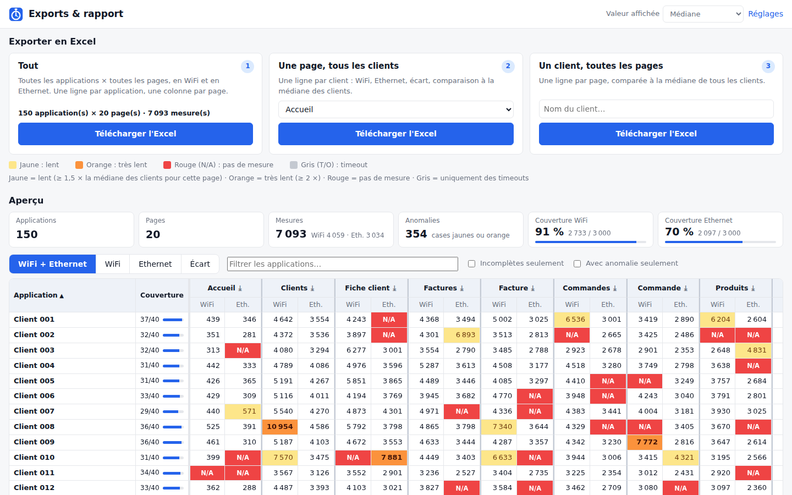
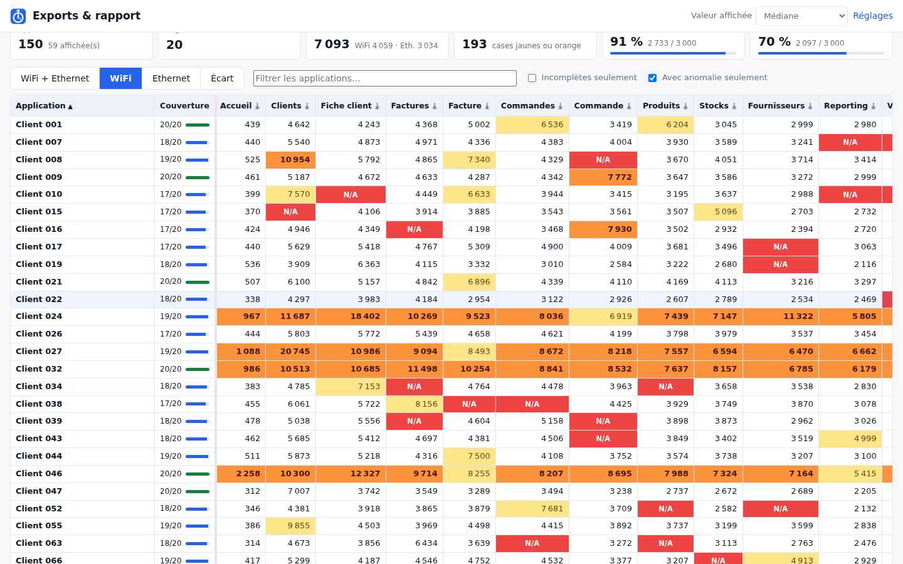

# Insigth

Optimiser les requêtes SQL en analysant le temps de réponse des pages.

**Insigth** est une extension Chrome qui mesure, à la demande, le temps entre **le clic** et
**l'affichage complet** d'une page web. Pour chaque mesure, vous indiquez l'application et la page ;
la mesure est enregistrée par réseau (**WiFi** ou **Ethernet**), puis exportée en Excel. Les
cases sont colorées en cas d'anomalie, et en rouge quand la mesure n'existe pas.

Conçue pour un parc de **100 à 200 applications** quasi identiques d'une vingtaine de pages.

## Le parcours

| 1. Formulaire | 2. En attente du clic | 3. Résultat |
| :-: | :-: | :-: |
|  |  |  |

1. Cliquez sur l'icône Insigth : le **panneau latéral** s'ouvre. Il reste ouvert pendant que vous
   cliquez dans votre application.
2. Choisissez le réseau (**WiFi** / **Ethernet**), le **nom de l'application** et le **nom de la page**,
   puis cliquez sur **Lancer l'enregistrement** (ou appuyez sur Entrée).
3. Dans la page, cliquez sur le lien ou le menu qui ouvre la page à mesurer. Le chrono part **au
   clic** et s'arrête quand la page est **complètement affichée**.
4. Le temps s'affiche et la mesure est enregistrée. Trois choix s'offrent à vous :
   - **↻ Relancer en Ethernet** (ou en WiFi) : même application, même page, sur l'autre réseau.
     L'onglet revient tout seul à la page de départ ; branchez ou débranchez le câble, puis recliquez
     sur le même lien ;
   - **↻ Refaire en WiFi** : une mesure de plus sur le même réseau (pour une médiane fiable) ;
   - **Page suivante →** : retour au formulaire. L'application est conservée et la page suivante
     de la liste qui n'a pas encore été mesurée est proposée.

Pendant ce temps, un petit indicateur en bas à droite de la page affiche l'état : prêt, mesure en
cours, puis résultat.

**Pour aller plus vite :**

- les noms d'applications et de pages s'**auto-complètent** ; « client a » est automatiquement
  rattaché à « Client A » ;
- le nom de l'application est **proposé d'après l'onglet** ouvert, à partir des mesures déjà faites
  sur ce site ou de l'URL déclarée dans les réglages ;
- le panneau montre l'**avancement** de l'application : pages mesurées en WiFi et en Ethernet, et
  pages restantes (cliquez dessus pour les choisir) ;
- raccourci clavier **Alt + Maj + M** : il lance l'enregistrement avec les valeurs du formulaire sans
  ouvrir le panneau (modifiable dans `chrome://extensions/shortcuts`).

## Installation

1. Récupérez ce dépôt (`git clone` ou « Download ZIP » puis décompressez).
2. Dans Chrome, ouvrez `chrome://extensions` et activez le **Mode développeur**.
3. Cliquez sur **Charger l'extension non empaquetée** et sélectionnez le dossier **`extension/`**.
4. Épinglez l'icône Insigth (pièce de puzzle → épingle). Le badge indique le réseau courant
   (`WiFi` / `ETH`) ou `PRÊT` quand une mesure attend votre clic.

Chrome 116+ (ou Edge, Brave… récents). Pour mettre à jour : `chrome://extensions` → ↻ sur Insigth.
Les mesures de la version précédente sont converties automatiquement.

## Exports

Bouton **Exports** du panneau :



| Export | Contenu |
| --- | --- |
| **1. Tout** | une ligne par application, une colonne par page ; feuilles *WiFi + Ethernet* (deux colonnes par page), *WiFi*, *Ethernet*, *Écart WiFi-Ethernet* (%), *Référence par page* (médianes utilisées pour les couleurs), *Mesures* (toutes les mesures brutes) |
| **2. Une page, tous les clients** | une ligne par client : WiFi, Ethernet, écart, « vs médiane », nombre de mesures, date ; médiane, minimum et maximum en bas ; mesures brutes de la page |
| **3. Un client, toutes les pages** | une ligne par page : WiFi, Ethernet, écart, médiane de tous les clients et comparaison ; mesures brutes du client |

Dans chaque tableau, les en-têtes et le nom sont figés et des filtres sont posés (tri sur n'importe
quelle colonne). La valeur affichée est la **médiane** des mesures par défaut (ou moyenne, min, max,
dernière). Les mesures en timeout sont exclues des calculs.

**Couleurs :**

| Case | Signification |
| --- | --- |
| jaune | **lent** : ≥ 1,5 × la médiane des clients pour cette page et ce réseau |
| orange | **très lent** : ≥ 2 × la médiane |
| rouge `N/A` | **pas de mesure** : page inexistante dans l'appli, ou pas encore mesurée sur ce réseau |
| gris `TIMEOUT` | uniquement des mesures en timeout |

La comparaison à la médiane démarre dès que 3 clients sont mesurés sur la page. Les seuils sont
réglables (**Réglages → Anomalies**), y compris des seuils absolus en secondes (« au-delà de 5 s,
c'est anormal ») et le seuil d'écart WiFi / Ethernet signalé en jaune (50 % par défaut).

La page Exports affiche aussi un **aperçu** de la grille applications × pages, avec les mêmes
couleurs. On peut :

- trier en cliquant sur un en-tête ;
- filtrer par nom, ou n'afficher que les applis incomplètes ou que celles qui ont une anomalie ;
- exporter une page avec ⤓ ;
- ouvrir le détail d'un client en cliquant sur son nom.



## Réglages


- **Applications** : la liste proposée dans le formulaire. Les applis mesurées s'y ajoutent toutes
  seules.
  - **Import en masse** : collez une colonne de noms depuis Excel, ou deux colonnes (nom, URL).
  - L'**URL est facultative** : elle sert seulement à pré-remplir le nom d'après l'onglet.
  - **Renommer** une application renomme aussi ses mesures ; si le nouveau nom existe déjà, les
    deux sont fusionnées. C'est pratique pour corriger une faute de frappe.
- **Pages** : l'ordre des colonnes des exports, qui est aussi l'ordre utilisé par « Page suivante ».
  - Collez votre liste d'une vingtaine de pages avec **+ Ajouter des pages**.
  - Renommer une page renomme aussi ses mesures.
  - On peut masquer une page des exports.
  - Une page ajoutée apparaît en rouge partout où elle n'a pas encore été mesurée.
- **Mesure** : délai de calme (1 s), durée maximale (120 s), zones à ignorer (sélecteurs CSS d'une
  horloge, d'un carrousel…), indicateur sur la page.
- **Anomalies** : seuils des couleurs.
- **Données** : sauvegarde / import JSON (pour fusionner les mesures de deux postes), suppression.

## Comment le temps est mesuré

- **Départ = le clic** (ou la touche Entrée) fait après « Lancer l'enregistrement ».
  - Si le clic charge une nouvelle page, l'instant du clic est mémorisé juste avant que la page
    soit quittée. Le temps inclut donc la **réponse du serveur** (requêtes SQL), le téléchargement
    et l'affichage.
  - Si la page change sans rechargement (application Angular, React…), la mesure se fait dans la
    page.
  - Un clic qui ne change pas l'URL (menu déroulant, champ…) est ignoré : la mesure attend le clic
    suivant.
  - Sans clic (URL tapée dans la barre d'adresse), le départ est le début de la navigation.
- **Fin = affichage complet**, c'est-à-dire l'instant de la **dernière activité** une fois que :
  - l'évènement `load` de la page est passé ;
  - aucune requête `fetch` / `XMLHttpRequest` n'est en cours ;
  - la page n'a plus bougé pendant le délai de calme (1 s).

  Ce délai sert seulement à détecter la fin ; il n'est **pas** ajouté au temps mesuré.
- Les scripts de mesure ne sont injectés **que pendant une mesure**, dans l'onglet concerné. Le
  reste du temps, l'extension n'agit sur aucune page.

## WiFi ou Ethernet ?

Chrome ne permet pas de savoir si le poste est en WiFi ou en Ethernet (sauf sur ChromeOS / Android) :
le réseau se choisit dans le panneau et reste affiché sur le badge. Pensez à le basculer quand vous
changez de connexion ; le bouton « Relancer en … » le fait pour vous.

**Deux postes ?** Mesurez en WiFi sur l'un et en Ethernet sur l'autre. Ensuite, dans **Réglages →
Données**, faites « Sauvegarder » sur le premier poste puis « Importer / fusionner » sur le second.

## Conseils pour des mesures fiables

- Faites 2 ou 3 mesures par page (« Refaire en … ») et gardez la **médiane**.
- Mêmes conditions entre WiFi et Ethernet : même poste, même compte, mêmes données.
- Fermez les DevTools et les onglets lourds pendant les mesures.
- Une mesure aberrante se supprime d'un clic (✕), depuis le panneau ou la page Exports.

## Limites

- Seul le cadre principal est mesuré (pas le contenu des `<iframe>`).
- Un lien qui s'ouvre dans un nouvel onglet n'est pas mesuré.
- Les WebSockets / EventSource ne comptent pas comme des requêtes en cours.
- « Relancer » recharge la page de départ par son URL : si elle était le résultat d'un formulaire
  (POST), revenez-y à la main avant de recliquer.

## Confidentialité et permissions

- `storage`, `unlimitedStorage` : mesures et réglages stockés localement dans Chrome.
- `sidePanel` : le panneau de mesure.
- `scripting` + accès aux sites : injection des scripts de mesure dans l'onglet mesuré,
  uniquement pendant une mesure.
- Aucune donnée n'est envoyée sur Internet, à part les fichiers que vous téléchargez vous-même.

## Structure du projet

```
extension/
  manifest.json          Manifest V3
  background.js          service worker : déroulé d'une mesure (prêt → mesure → résultat → relance),
                         injection des scripts, enregistrement, badge, raccourci clavier
  content/
    page-hook.js         contexte de la page : suivi des requêtes fetch / XHR
    content.js           mesure clic → affichage complet, indicateur sur la page
  panel/                 panneau latéral : formulaire, chrono, résultat
  report/                exports (3 types) et aperçu applications × pages
  options/               référentiel applications / pages, réglages, anomalies, données
  lib/
    report.js            agrégation, anomalies, contenu des 3 exports Excel
    xlsx.js              générateur .xlsx sans dépendance (cases colorées)
    storage.js           stockage, renommage, sauvegarde / import, migration
    names.js             noms (normalisation, suggestion d'appli, page suivante)
    apps.js              import en masse des applications et des pages
    urls.js, export.js, format.js
tests/
  unit/                  tests Node (node --test)
  e2e/e2e.mjs            test de bout en bout avec Chromium + Playwright
```

## Développement

```bash
npm test               # tests unitaires (Node 18+, aucune dépendance)
npm install            # installe Playwright pour le test de bout en bout
npm run test:e2e       # charge l'extension dans Chromium et déroule le parcours complet
npm run zip            # crée insigth-extension.zip (dossier extension/)
```

Le test de bout en bout lance deux applications de démonstration dont les délais sont connus :
serveur 300 / 600 ms, appel de données 500 ms, navigation sans rechargement 400 ms. Il déroule le
parcours du panneau : lancer, cliquer, relancer en Ethernet, page suivante, application sans
rechargement, annuler, suggestion du nom. Il vérifie ensuite les temps mesurés, les 3 exports,
l'import en masse et le renommage, puis génère une démo de 150 clients × 20 pages. Les captures et
les fichiers Excel sont écrits dans `tests/e2e/out/`.
