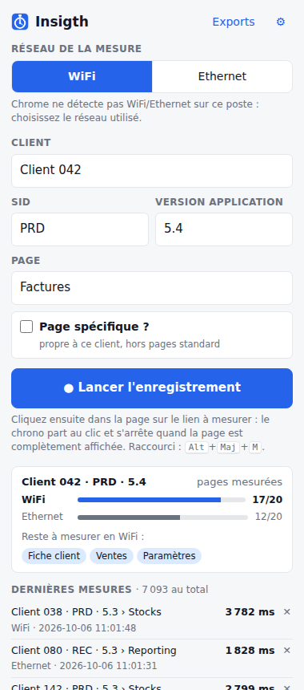
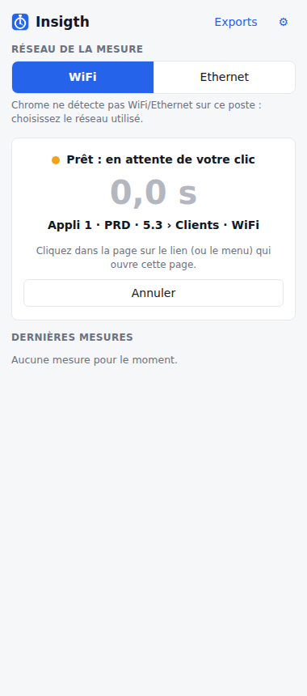
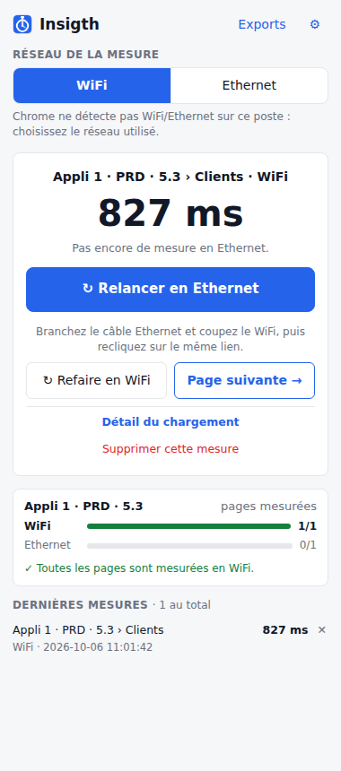
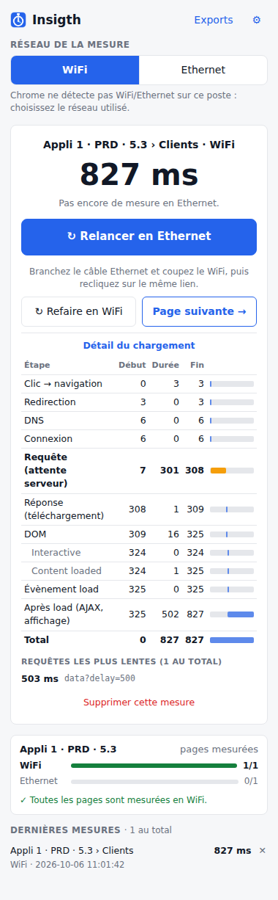
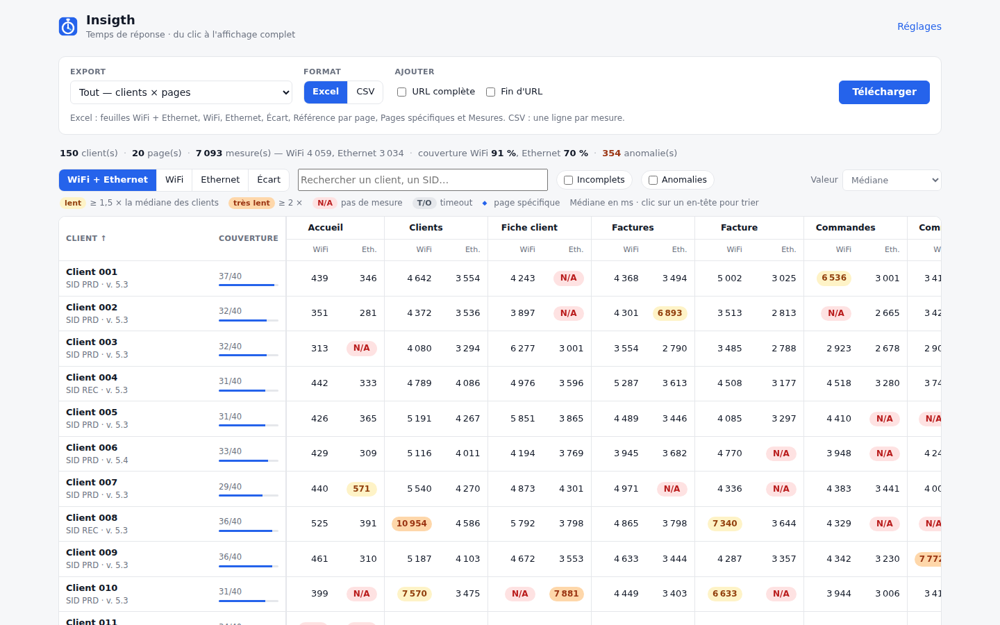
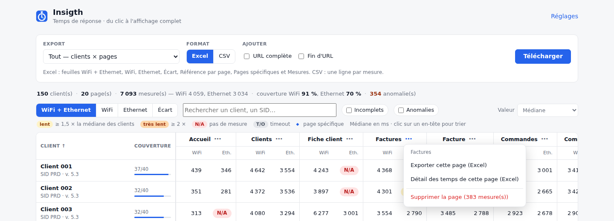
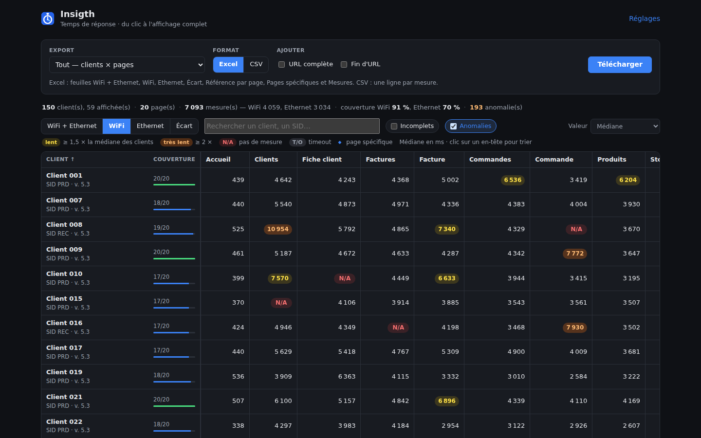
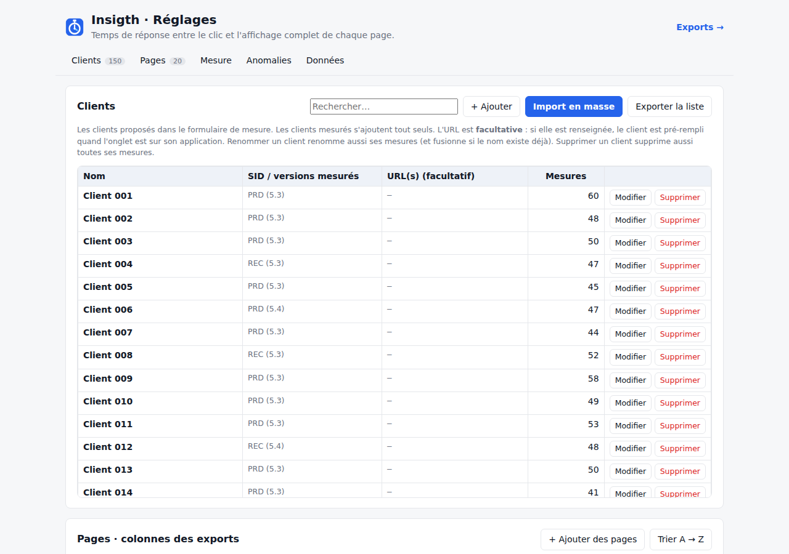

# Insigth

Optimiser les requêtes SQL en analysant le temps de réponse des pages.

**Insigth** est une extension Chrome qui mesure, à la demande, le temps entre **le clic** et
**l'affichage complet** d'une page web. Pour chaque mesure, vous indiquez le **client**, son
**SID**, la **version de l'application** et la **page**. La mesure est enregistrée par réseau
(**WiFi** ou **Ethernet**), avec le détail du chargement (attente serveur, téléchargement, DOM,
appels AJAX…), puis exportée en Excel ou en CSV. Les anomalies sont colorées, et les cases sans
mesure apparaissent en rouge.

Conçue pour un parc de **100 à 200 clients** sur une application quasi identique d'une vingtaine
de pages.

## Le parcours

| 1. Formulaire | 2. En attente du clic | 3. Résultat |
| :-: | :-: | :-: |
|  |  |  |

1. Cliquez sur l'icône Insigth : le **panneau latéral** s'ouvre. Il reste ouvert pendant que vous
   cliquez dans l'application.
2. Choisissez le réseau (**WiFi** / **Ethernet**) et remplissez **Client**, **SID**,
   **Version application** et **Page**. Cochez **Page spécifique ?** si la page est propre à ce
   client (hors pages standard). Cliquez ensuite sur **Lancer l'enregistrement** (ou appuyez sur
   Entrée).
3. Dans la page, cliquez sur le lien ou le menu qui ouvre la page à mesurer. Le chrono part **au
   clic** et s'arrête quand la page est **complètement affichée**.
4. Le temps s'affiche et la mesure est enregistrée. Trois choix s'offrent à vous :
   - **↻ Relancer en Ethernet** (ou en WiFi) : même client, même page, sur l'autre réseau.
     L'onglet revient tout seul à la page de départ ; branchez ou débranchez le câble, puis recliquez
     sur le même lien ;
   - **↻ Refaire en WiFi** : une mesure de plus sur le même réseau (pour une médiane fiable) ;
   - **Page suivante →** : retour au formulaire. Client, SID et version sont conservés, et la page
     suivante de la liste qui n'a pas encore été mesurée est proposée.

Un petit indicateur en bas à droite de la page affiche l'état : prêt, mesure en cours, puis
résultat.

### Détail du chargement

Juste après une mesure, **Détail du chargement** affiche le découpage du temps, comme l'extension
« Page load time » (en ms depuis le clic) :



| Étape | Signification |
| --- | --- |
| Clic → navigation | entre le clic et le départ de la requête |
| Redirection, DNS, Connexion | réseau avant la requête |
| **Requête (attente serveur)** | temps de réponse du serveur, **requêtes SQL comprises** |
| Réponse (téléchargement) | réception de la page |
| DOM (Interactive, Content loaded) | construction de la page |
| Évènement load | fin du chargement des ressources |
| Après load (AJAX, affichage) | appels de données et affichage après le chargement |
| Requêtes les plus lentes | appels fetch / XHR de la page, avec leur durée et leur URL |

Pour une page qui change sans rechargement (application Angular, React…), le détail montre les
requêtes AJAX puis l'affichage. Ce détail est enregistré avec chaque mesure. Ailleurs, on le
retrouve uniquement dans l'export **Détail des temps — une page**.

### Pour aller plus vite

- **Auto-complétion** des clients, SID, versions et pages. « client a » est automatiquement rattaché
  à « Client A ».
- **Client proposé d'après l'onglet** ouvert, à partir des mesures déjà faites sur ce site ou de
  l'URL déclarée dans les réglages. Quand vous choisissez un client, son SID et sa version sont
  repris de sa dernière mesure.
- **Page spécifique ?** se coche toute seule si la page a déjà été déclarée spécifique pour ce client,
  et se décoche sinon (par exemple avec « Page suivante »).
- **Avancement** de la ligne client · SID · version : pages mesurées en WiFi et en Ethernet, et pages
  restantes (cliquez dessus pour les choisir).
- **Raccourci Alt + Maj + M** : il lance l'enregistrement avec les valeurs du formulaire, sans ouvrir
  le panneau. Il se modifie dans `chrome://extensions/shortcuts`.

## Installation

1. Récupérez ce dépôt (`git clone` ou « Download ZIP » puis décompressez).
2. Dans Chrome, ouvrez `chrome://extensions` et activez le **Mode développeur**.
3. Cliquez sur **Charger l'extension non empaquetée** et sélectionnez le dossier **`extension/`**.
4. Épinglez l'icône Insigth (pièce de puzzle → épingle). Le badge indique le réseau courant
   (`WiFi` / `ETH`), ou `PRÊT` quand une mesure attend votre clic.

Chrome 116+ (ou Edge, Brave… récents). Pour mettre à jour : `chrome://extensions` → ↻ sur Insigth.
Les mesures des versions précédentes sont conservées.

## Tableau de bord et exports

Bouton **Exports** du panneau :



**Exporter** se fait en une ligne : choisissez le type, la page ou le client, le format (**Excel**
ou **CSV**), et cochez au besoin **URL complète** et **Fin d'URL**. Ces deux informations sont
enregistrées en coulisse avec chaque mesure, et ces cases les ajoutent aux colonnes des mesures.
La fin d'URL, c'est par exemple `f?p=103:21:…` pour une page Oracle APEX.

| Type | Excel | CSV |
| --- | --- | --- |
| **Tout — clients × pages** | une ligne par client · SID · version, une colonne par page ; feuilles *WiFi + Ethernet*, *WiFi*, *Ethernet*, *Écart*, *Référence par page*, *Pages spécifiques*, *Mesures* | toutes les mesures, une par ligne |
| **Une page — tous les clients** | une ligne par client · SID · version : page spécifique (Oui / Non), WiFi, Ethernet, écart, « vs médiane », nombre de mesures ; médiane, min et max en bas | les mesures de la page |
| **Un client — toutes les pages** | une feuille par SID / version : chaque page (spécifique ou non) comparée à la médiane des clients | les mesures du client |
| **Détail des temps — une page** | une ligne par mesure : chaque étape du chargement, requête la plus lente ; + feuille *Requêtes* | idem, une ligne par mesure |

La colonne **Page spécifique** (Oui / Non) figure aussi dans toutes les mesures (Excel et CSV) et
dans le détail des temps. La feuille *Pages spécifiques* liste chaque client · SID · version avec ses
pages spécifiques. Dans la grille du tableau de bord, une page spécifique est marquée ◆.

Dans Excel, les en-têtes et les colonnes Client / SID / Version sont figés, et des filtres
permettent de trier sur n'importe quelle colonne. La valeur affichée est la **médiane** des mesures
par défaut (ou moyenne, min, max, dernière). Les mesures en timeout sont exclues des calculs.

**Couleurs :**

| Case | Signification |
| --- | --- |
| jaune | **lent** : ≥ 1,5 × la médiane des clients pour cette page et ce réseau |
| orange | **très lent** : ≥ 2 × la médiane |
| rouge `N/A` | **pas de mesure** : page inexistante pour ce client, ou pas encore mesurée sur ce réseau |
| gris `TIMEOUT` | uniquement des mesures en timeout |

La comparaison à la médiane démarre dès que 3 lignes client sont mesurées sur la page. Les seuils
se règlent dans **Réglages → Anomalies** : seuils absolus en secondes possibles, et seuil d'écart
WiFi / Ethernet (50 % par défaut).

**La grille** affiche les mêmes couleurs, sous forme de pastilles. Elle propose :

- 4 vues : WiFi + Ethernet, WiFi, Ethernet, Écart ;
- le tri en cliquant sur un en-tête ;
- la recherche par client ou SID ;
- les filtres « Incomplets » et « Anomalies » ;
- le détail d'un client en cliquant sur son nom.

Le menu **⋯** d'une page ou d'un client permet de l'exporter ou de le **supprimer** :



| Supprimer… | Où |
| --- | --- |
| une mesure | ✕ dans la liste des mesures (tableau de bord, détail d'un client, panneau), ou « Supprimer cette mesure » juste après la mesure |
| une page (tous clients) | menu ⋯ de l'en-tête de la page, ou Réglages → Pages |
| une ligne SID / version | menu ⋯ du client (si le client a plusieurs SID / versions) |
| un client (toutes versions) | menu ⋯ du client, ou Réglages → Clients |

Toute suppression demande une confirmation.

Thème sombre automatique :



## Réglages



- **Clients** : la liste proposée dans le formulaire. Les clients mesurés s'y ajoutent tout seuls, et
  la colonne « SID / versions mesurés » les récapitule.
  - **Import en masse** : collez une colonne de noms depuis Excel, ou deux colonnes (nom, URL).
  - L'**URL est facultative** : elle sert seulement à pré-remplir le client d'après l'onglet.
  - **Renommer** un client renomme aussi ses mesures ; si le nouveau nom existe déjà, les deux sont
    fusionnés.
- **Pages** : l'ordre des colonnes des exports, qui est aussi l'ordre utilisé par « Page suivante ».
  - Collez votre liste de pages avec **+ Ajouter des pages**.
  - Renommer une page renomme aussi ses mesures.
  - On peut masquer une page des exports ou la supprimer avec ses mesures.
- **Mesure** : délai de calme (1 s), durée maximale (120 s), zones à ignorer (sélecteurs CSS d'une
  horloge, d'un carrousel…), indicateur sur la page.
- **Anomalies** : seuils des couleurs.
- **Données** : sauvegarde / import JSON (pour fusionner les mesures de deux postes), suppression de
  toutes les mesures.

## Comment le temps est mesuré

- **Départ = le clic** (ou la touche Entrée) fait après « Lancer l'enregistrement ».
  - Si le clic charge une nouvelle page, l'instant du clic est mémorisé juste avant que la page
    soit quittée. Le temps inclut donc la **réponse du serveur** (requêtes SQL), le téléchargement
    et l'affichage.
  - Si la page change sans rechargement (Angular, React…), la mesure se fait dans la page.
  - Un clic qui ne change pas l'URL (menu déroulant, champ…) est ignoré : la mesure attend le clic
    suivant.
  - Sans clic (URL tapée dans la barre d'adresse), le départ est le début de la navigation.
- **Fin = affichage complet**, c'est-à-dire l'instant de la **dernière activité** une fois que :
  - l'évènement `load` est passé ;
  - aucune requête `fetch` / `XMLHttpRequest` n'est en cours ;
  - la page n'a plus bougé pendant le délai de calme (1 s).

  Ce délai sert seulement à détecter la fin ; il n'est **pas** ajouté au temps mesuré.
- **Ce qui est enregistré avec chaque mesure** : client, SID, version, page, page spécifique, réseau, durée,
  détail du chargement, URL complète, fin d'URL et page de départ.
- Les scripts de mesure ne sont injectés **que pendant une mesure**, dans l'onglet concerné.

## WiFi ou Ethernet ?

Chrome ne permet pas de savoir si le poste est en WiFi ou en Ethernet (sauf sur ChromeOS / Android) :
le réseau se choisit dans le panneau et reste affiché sur le badge. Le bouton « Relancer en … » le
bascule pour vous.

**Deux postes ?** Mesurez en WiFi sur l'un et en Ethernet sur l'autre. Ensuite, dans **Réglages →
Données**, faites « Sauvegarder » sur le premier poste puis « Importer / fusionner » sur le second.

## Conseils pour des mesures fiables

- Faites 2 ou 3 mesures par page (« Refaire en … ») et gardez la **médiane**.
- Mêmes conditions entre WiFi et Ethernet : même poste, même compte, mêmes données.
- Fermez les DevTools et les onglets lourds pendant les mesures.
- Pour une page lente, regardez l'**attente serveur** dans le détail : si c'est elle qui domine, le
  temps est passé côté serveur (requêtes SQL), pas dans le réseau ni l'affichage.

## Limites

- Seul le cadre principal est mesuré (pas le contenu des `<iframe>`).
- Un lien qui s'ouvre dans un nouvel onglet n'est pas mesuré.
- Les WebSockets / EventSource ne comptent pas comme des requêtes en cours.
- « Relancer » recharge la page de départ par son URL : si elle était le résultat d'un formulaire
  (POST), revenez-y à la main avant de recliquer.
- Pour les requêtes vers un autre domaine, le navigateur ne donne parfois que la durée totale.

## Confidentialité et permissions

- `storage`, `unlimitedStorage` : mesures et réglages stockés localement dans Chrome.
- `sidePanel` : le panneau de mesure.
- `scripting` + accès aux sites : injection des scripts de mesure dans l'onglet mesuré,
  uniquement pendant une mesure.
- Aucune donnée n'est envoyée sur Internet, à part les fichiers que vous téléchargez vous-même.

## Structure du projet

```
extension/
  manifest.json          Manifest V3
  background.js          service worker : déroulé d'une mesure (prêt → mesure → résultat → relance),
                         injection des scripts, enregistrement, badge, raccourci clavier
  content/
    page-hook.js         contexte de la page : suivi des requêtes fetch / XHR
    content.js           mesure clic → affichage complet, détail du chargement, indicateur
  panel/                 panneau latéral : formulaire, chrono, résultat, détail
  report/                tableau de bord : export, grille clients × pages, mesures
  options/               référentiel clients / pages, réglages, anomalies, données
  lib/
    report.js            agrégation (lignes client · SID · version), anomalies, exports Excel / CSV
    timing.js            étapes du détail du chargement
    xlsx.js              générateur .xlsx sans dépendance (cases colorées)
    storage.js           stockage, renommage, suppression, sauvegarde / import, migration
    names.js             noms (normalisation, suggestion du client, page suivante)
    apps.js              import en masse des clients et des pages
    urls.js, export.js, format.js
tests/
  unit/                  tests Node (node --test)
  e2e/e2e.mjs            test de bout en bout avec Chromium + Playwright
```

## Développement

```bash
npm test               # tests unitaires (Node 18+, aucune dépendance)
npm install            # installe Playwright pour le test de bout en bout
npm run test:e2e       # charge l'extension dans Chromium et déroule le parcours complet
npm run zip            # crée insigth-extension.zip (dossier extension/)
```

Le test de bout en bout lance deux applications de démonstration dont les délais sont connus :
serveur 300 / 600 ms, appel de données 500 ms, navigation sans rechargement 400 ms. Il déroule tout
le parcours du panneau : client / SID / version, relance en Ethernet, page suivante, application
sans rechargement, annulation, suggestion. Il vérifie le détail des temps (attente serveur, appel
AJAX), les 4 exports, le CSV avec les URL et les suppressions, puis génère une démo de 150 clients ×
20 pages. Captures et fichiers dans `tests/e2e/out/`.
