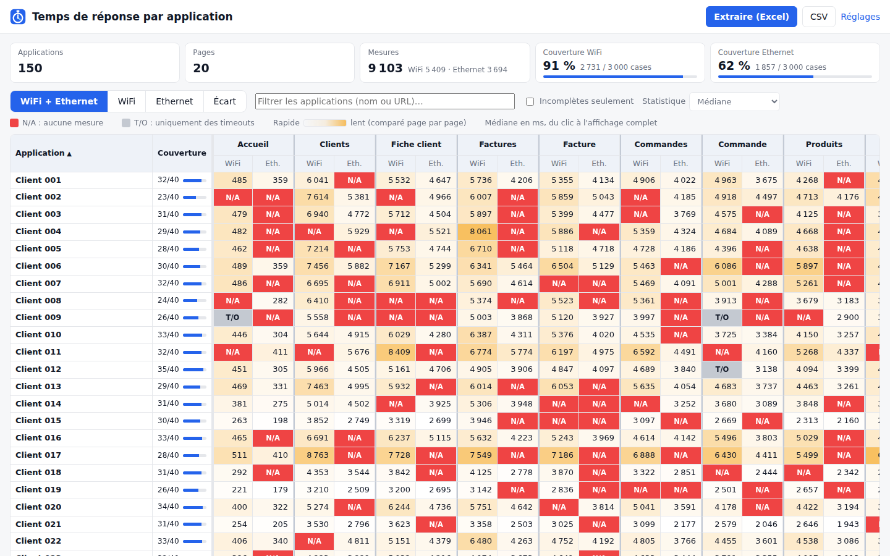
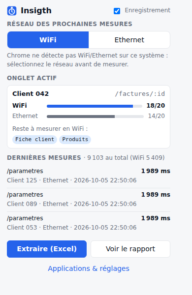
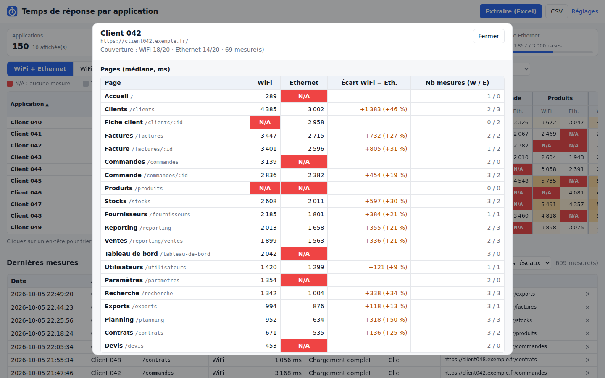

# Insigth

Optimiser les requêtes SQL en analysant le temps de réponse des pages.

**Insigth** est une extension Chrome qui mesure, sur chaque page de vos applications web, le temps
écoulé entre **le clic** et **l'affichage complet** de la page. Elle enregistre chaque mesure par
application, par page et par réseau (**WiFi** ou **Ethernet**), puis produit d'un clic un fichier
Excel comparatif où **les cases rouges** signalent les pages sans mesure.

Pensé pour un parc de **100 à 200 applications** quasi identiques d'une vingtaine de pages :
**une ligne par application, une colonne par page**.



## Fonctionnalités

- Mesure automatique du temps **clic → affichage complet**, page par page :
  - pages classiques (chaque clic charge une nouvelle page HTML : PHP, ASP.NET, JSP…) ;
  - applications monopages / SPA (Angular, React, Vue…) dont l'URL change sans recharger la page.
- **Des centaines d'applications** identiques ou presque, saisies à la main ou **collées en masse
  depuis Excel** (nom + URL de base) : les pages sont alignées par leur chemin relatif pour être
  comparées colonne par colonne.
- **WiFi / Ethernet** : chaque mesure porte le réseau sélectionné dans le popup (rappelé sur
  l'icône : `WiFi` / `ETH`).
- **Bouton « Extraire (Excel) »** : un fichier `.xlsx` « une ligne par appli, une colonne par
  page », avec volets figés, filtres et couleurs.
  - **Case rouge** : aucune mesure pour cette page (page inexistante dans l'appli ou pas encore
    mesurée sur ce réseau).
  - **Case grise** : uniquement des mesures en timeout.
  - **Dégradé blanc → orange** page par page : les applis les plus lentes sur une page ressortent.
- Rapport dans le navigateur : vues WiFi + Ethernet / WiFi / Ethernet / Écart, tri en cliquant
  sur une colonne, filtre par nom ou URL, « incomplètes seulement », détail d'une appli en un clic,
  choix de la statistique (moyenne, médiane, min, max, dernière mesure), export CSV.
- **Colonnes de pages réglables** : ordre, libellé lisible (« Fiche client » au lieu de
  `/clients/:id`), pages masquées, pages « attendues ».
- Popup : avancement de l'appli ouverte (pages mesurées / restantes sur le réseau courant).
- Petit indicateur sur la page après chaque mesure : 
- Sauvegarde / import JSON pour **fusionner les mesures de deux postes** (ex. un portable en WiFi,
  un fixe en Ethernet).
- Aucune donnée envoyée sur Internet : tout reste dans le stockage local de Chrome.

## Installation

1. Récupérez ce dépôt (`git clone` ou « Download ZIP » puis décompressez).
2. Dans Chrome, ouvrez `chrome://extensions`.
3. Activez le **Mode développeur** (en haut à droite).
4. Cliquez sur **Charger l'extension non empaquetée** et sélectionnez le dossier **`extension/`**.
5. Épinglez l'icône Insigth (pièce de puzzle → épingle) pour voir le réseau courant sur le badge.

Compatible Chrome 111+ et navigateurs Chromium (Edge, Brave…).

## Configuration des applications

La page **Applications & réglages** s'ouvre à l'installation (ou via le popup).

Pour chaque application : un **nom** et une ou plusieurs **URL de base**.

| Application | URL de base                         |
| ----------- | ----------------------------------- |
| Recette     | `https://recette.mondomaine.fr/`    |
| Production  | `https://appli.mondomaine.fr/`      |
| Client A    | `https://serveur.local/clientA/`    |

### Import en masse (100 – 200 applications)

Bouton **Import en masse** : collez directement deux colonnes copiées depuis Excel (nom, URL),
ou chargez un fichier CSV. Une application par ligne :

```
Client A;https://clienta.mondomaine.fr/
Client B;https://serveur/clientB/ | https://serveur-secours/clientB/
https://serveur/clientC/
```

- séparateur `;`, tabulation (copier-coller Excel) ou `,` ;
- plusieurs URL pour une même appli : séparez-les par `|` ;
- une ligne avec seulement une URL crée une appli nommée d'après l'URL ;
- une appli existante (même nom) reçoit simplement les nouvelles URL ;
- l'aperçu indique les applis reconnues et les lignes en erreur avant l'import.

**Exporter la liste** produit le même format (réimportable). La liste se filtre par nom ou URL et
signale les URL déclarées par deux applis.


### Pages (colonnes du rapport)

Les pages sont détectées automatiquement. Dans la section **Pages** des réglages : ordre des
colonnes (↑ ↓), libellé affiché en en-tête, pages masquées, et pages **attendues** (ajoutées à la
main : elles apparaissent en rouge dans toutes les applis où elles n'ont pas encore été mesurées).

La page est identifiée par son chemin **relatif** à l'URL de base : `https://serveur.local/clientA/Factures/42`
et `https://appli.mondomaine.fr/factures/1337` deviennent toutes les deux `/factures/:id` et sont
comparées sur la même ligne. Par défaut les paramètres `?…` sont ignorés, les identifiants
numériques/UUID sont remplacés par `:id` et la casse est ignorée (modifiable dans les réglages,
appliqué aussi aux mesures existantes).

> Après avoir ajouté ou modifié une application, rechargez les onglets déjà ouverts dessus.

## Utilisation

1. Ouvrez le popup et choisissez le **réseau** : **WiFi** ou **Ethernet**.
2. Naviguez normalement dans l'application : chaque clic qui mène à une page est mesuré.
3. **Attendez l'indicateur « ✓ … ms »** en bas à droite avant de cliquer à nouveau (un clic avant
   la fin de l'affichage annule la mesure en cours, car elle n'aurait pas de sens).
4. Changez de réseau (débranchez le câble / coupez le WiFi), basculez le réseau dans le popup et
   refaites le parcours.
5. Cliquez sur **Extraire (Excel)** dans le popup (ou dans le rapport).

Le popup montre l'avancement de l'application ouverte : pages déjà mesurées en WiFi et en Ethernet,
et la liste des pages qu'il reste à mesurer sur le réseau courant.



### Le rapport

- **Vues** : WiFi + Ethernet côte à côte, WiFi seul, Ethernet seul (une colonne par page, plus
  compact), ou **Écart** WiFi − Ethernet (bleu : WiFi plus rapide, orange : WiFi plus lent).
- **Couverture** : nombre de cases mesurées par appli, et globalement en haut de page.
- **Tri** : cliquez sur un en-tête (une page, WiFi/Eth., Couverture, Application).
- **Filtre** par nom ou URL, case « Incomplètes seulement » pour voir ce qu'il reste à mesurer.
- **Détail** : cliquez sur une application pour ses pages, écarts et mesures (suppression possible).
- Le nom de l'appli et les en-têtes restent visibles pendant le défilement.



### Le fichier Excel

| Feuille                 | Contenu                                                                              |
| ----------------------- | ------------------------------------------------------------------------------------ |
| **Comparatif**          | une ligne par appli ; pour chaque page, deux colonnes WiFi / Ethernet ; couverture   |
| **WiFi**, **Ethernet**  | une ligne par appli, une colonne par page (plus lisible)                             |
| **Écart WiFi-Ethernet** | WiFi − Ethernet en ms (bleu / blanc / orange)                                         |
| **Pages**               | libellé ↔ chemin, nombre d'applis mesurées et médiane par page                       |
| **Mesures**             | toutes les mesures brutes (date, appli, page, réseau, durée, type, déclencheur, URL) |

Chaque tableau a ses en-têtes et la colonne « Application » figés, des filtres (tri par n'importe
quelle page) et un dégradé de couleur par page. Les colonnes sont l'**union des pages de toutes
les applications** : une page mesurée dans l'appli A mais absente de l'appli B apparaît en rouge
pour B. Valeurs en millisecondes selon la statistique choisie dans le rapport ; les mesures en
timeout sont exclues des statistiques.

## Comment le temps est mesuré

- **Départ = le clic** (ou la touche Entrée) de l'utilisateur.
  - Si le clic charge une nouvelle page HTML, l'instant du clic est mémorisé par l'extension juste
    avant que la page soit quittée et sert de départ à la nouvelle page : le temps inclut donc la
    réponse du serveur (requêtes SQL), le téléchargement et le rendu.
  - Sans clic (F5, URL saisie, favori), le départ est le début de la navigation.
  - Si le clic mène d'abord à une page hors application (page de connexion SSO, autre site…), la
    page de l'application atteinte ensuite est mesurée depuis le début de sa propre navigation :
    le temps passé sur la page intermédiaire n'est pas compté.
- **Fin = affichage complet**, c'est-à-dire l'instant de la **dernière activité** une fois que :
  - l'évènement `load` de la page est passé (pages classiques) ;
  - aucune requête `fetch` / `XMLHttpRequest` n'est en cours (données chargées en AJAX) ;
  - la page n'a plus été modifiée (DOM) pendant le délai de calme (1 s par défaut).

  Le délai de calme sert uniquement à détecter la fin : il n'est **pas** ajouté au temps mesuré.
- Un clic qui ne change pas de page (menu, case à cocher, onglet interne…) n'est pas enregistré.
- Si la page s'agite en permanence (horloge, carrousel, polling), la mesure s'arrête au bout de la
  durée maximale (120 s par défaut) et est marquée **timeout**. Déclarez ces zones dans
  « Zones à ignorer (sélecteurs CSS) » pour les exclure.

## WiFi ou Ethernet ?

Chrome ne permet pas aux extensions de connaître le type de connexion sur Windows, macOS ou Linux
(seulement sur ChromeOS/Android, où le popup l'affiche). Le réseau se choisit donc dans le popup ;
le badge de l'icône (`WiFi` bleu / `ETH` vert / `OFF` gris) rappelle en permanence le réseau qui
sera associé aux prochaines mesures.

**Deux postes ?** Mesurez en WiFi sur l'un, en Ethernet sur l'autre, puis dans **Réglages → Données** :
« Sauvegarder (JSON) » sur le premier et « Importer / fusionner (JSON) » sur le second. Les
applications sont reconnues par leur nom et les doublons sont ignorés.

## Conseils pour des mesures fiables

- Mesurez chaque page plusieurs fois et utilisez la **médiane** dans le rapport.
- Gardez les mêmes conditions entre WiFi et Ethernet (même poste, même compte, mêmes données).
- Fermez les DevTools et les onglets lourds pendant les mesures.
- Supprimez les mesures aberrantes depuis le rapport (bouton ✕ sur chaque ligne).

## Limites

- Seul le cadre principal est mesuré (pas le contenu des `<iframe>`).
- Les retours arrière/avant du navigateur ne sont pas mesurés (souvent servis depuis le cache).
- Les WebSockets / EventSource ne sont pas considérés comme des requêtes en cours.
- Un clic avec Ctrl/Cmd (nouvel onglet) mesure la nouvelle page depuis le début de sa navigation.

## Réglages

| Réglage                          | Défaut | Rôle                                                         |
| -------------------------------- | ------ | ------------------------------------------------------------ |
| Calme requis                     | 1000 ms | durée sans activité réseau ni modification de la page        |
| Durée maximale                   | 120 s  | au-delà, mesure en timeout                                   |
| Zones à ignorer                  | —      | sélecteurs CSS dont les modifications sont ignorées          |
| Indicateur sur la page           | oui    | affiche le résultat en bas à droite                          |
| Ignorer les paramètres d'URL     | oui    | `/liste?page=2` = `/liste`                                   |
| Regrouper les identifiants       | oui    | `/clients/42` → `/clients/:id`                               |
| Ignorer la casse                 | oui    | `/Clients` = `/clients`                                      |

## Confidentialité et permissions

- `storage`, `unlimitedStorage` : stockage local des applications, réglages et mesures.
- `scripting` + accès aux sites : les scripts de mesure sont injectés **uniquement** sur les hôtes
  des applications configurées.
- Aucune requête réseau n'est émise par l'extension, aucune donnée ne quitte le poste (hors
  exports que vous téléchargez).

## Structure du projet

```
extension/
  manifest.json          Manifest V3
  background.js          service worker : injection des scripts, clics en attente, enregistrement, badge
  content/
    page-hook.js         contexte de la page : suivi des requêtes fetch / XHR
    content.js           mesure clic → affichage complet, indicateur sur la page
  lib/
    urls.js              rattachement URL → application, clé de page
    storage.js           stockage, sauvegarde / import
    apps.js              import en masse, export et contrôle de la liste d'applications
    report.js            agrégation (applis × pages), feuilles Excel, CSV
    xlsx.js              générateur .xlsx sans dépendance (cases colorées)
    export.js, format.js
  popup/                 popup (réseau, avancement de l'appli, Extraire)
  options/               applications (import en masse), pages, réglages, données
  report/                rapport applis × pages
tests/
  unit/                  tests Node (node --test)
  e2e/e2e.mjs            test de bout en bout avec Chromium + Playwright
```

## Développement

```bash
npm test               # tests unitaires (Node 18+, aucune dépendance)
npm install            # installe Playwright pour le test de bout en bout
npm run test:e2e       # charge l'extension dans Chromium et vérifie mesures, rapport et export Excel
npm run zip            # crée insigth-extension.zip (dossier extension/)
```

Le test de bout en bout lance deux applications de démonstration aux délais connus (serveur 300 ms /
600 ms, appel de données 500 ms, SPA 400 ms) et vérifie que les temps mesurés correspondent, puis
l'import en masse, les libellés de pages et un jeu de démonstration de 150 applications × 20 pages
(~9 000 mesures) ; les captures et les Excel produits sont écrits dans `tests/e2e/out/`.

Après une modification du code de l'extension : `chrome://extensions` → bouton ↻ d'Insigth, puis
rechargez les onglets des applications.
